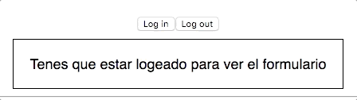
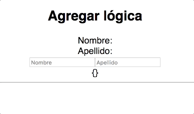

# Lección: Componiendo unos re componentes con Recompose

## Intro
> _Recompose is a React utility belt for function components and higher-order components. Think of it like lodash for React._

Listo, fín del curso. Ahre ☺️ xdxd.

Bueno, flogger out. Primero que nada, hola!
Me llamo **Gonzalo Pozzo** y en el momento de escribir esto era Frontend Developer en [The Next Ad](https://www.thenextad.com/) (De no ser así, hola desde el pasado!).
Hoy les vengo a hablar de una de las librerias que mas uso y mas me gusta, [Recompose](https://github.com/acdlite/recompose).
Como vimos un poco mas arriba, recompose es una libreria de utilidades para componentes y **high-order components** de React.

### 🙋‍♂️️ Ni idea que es un high-order component.
No os preocupeis, es mucho mas fácil de lo que parece.
Directo de [la documentación de React](https://reactjs.org/docs/higher-order-components.html):
> **A higher-order component is a function that takes a component and returns a new component.**
```javascript
const MiComponente = unHighOrderComponent(UnComponent);
```
Si usas [Redux](https://redux.js.org/docs/introduction/), su high-order component más conocido es *connect*. O si usas [Mobx](https://github.com/mobxjs/mobx) su high-order component más conocido es *observable*.
Si esto no te quedo claro, tranqui, esto recién empieza.

## Ejemplos
Basta de chacharas y vamos a ver algunos ejemplos de cosas que podemos hacer:

> Tip: [Acá](https://goncy.github.io/recompose-lesson) podes verlos a todos funcionando

### Rendering condicional - [CODE](./companion/src/components/ConditionalRendering.js) - [PLAYGROUND](https://codesandbox.io/s/zn95pwkm4)
Renderizar o no un componente basado en una prop que le llega, aislar ese caso por ejemplo para login nos permitiria mostrar secciones solo para usuarios logeados sin repetir codigo, o mostrar un loader/spinner mientras una prop de loading este en true, ahi es donde `branch` de recompose entra en juego.
> 

```javascript
const justForLoggedUsers = branch(
  // El primer parametro es una function que recibe las props de nuestro componente y debe devolver true o false
  ({ logged }) => !logged,
  // En caso de que devuelva true (el usuario no esta logeado) va a renderizar este componente, notese que esta wrapeado en la funcion renderComponent
  renderComponent(Placeholder)
  // En caso de que de false va a renderizar nuestro componente original, como lo usamos mas abajo
)

justForLoggedUsers(() => <div>Solo me ves si estas loggeado</div>)
```

### Agregar lógica - [CODE](./companion/src/components/AddLogic.js) - [PLAYGROUND](https://codesandbox.io/s/zl2336ro3x)
Muchas veces necesitamos agregar la misma lógica a varios de nuestros componentes, como por ejemplo, un state para guardar data de un formulario, con recompose y `withStateHandlers` podes crear tu propio high-order component y reutilizarlo en todos tus componentes
> 

```javascript
const withForm = withStateHandlers(
  // Armamos nuestro state inicial
  { formData: {} },
  {
    // Devolvemos nuestros handlers en un objeto donde cada key es un factory (una funcion que devuelve una funcion), la primer funcion recibe el state anterior, la segunda recibe los parametros que se le mandan en ejecucion
    setFormProp: ({ formData }) => (prop, value) => ({
      formData: { ...formData, [prop]: value }
    })
  }
)

withForm(({formData, setFormProp}) => <div>Esta es la info de mi formulario -> {JSON.stringify(formData)}</div>)
```

## Docs
* 📚 [Recompose API Docs](https://github.com/acdlite/recompose/blob/master/docs/API.md)
* ✏️ [Recompose Base fiddle](https://jsfiddle.net/samsch/p3vsmrvo/24/)

## Licencia
📄 [Licencia MIT](https://github.com/ndelvalle/workshop-vuejs/blob/master/LICENSE)

---
*Cualquier consulta, critica, PR o sugerencia es totalmente bienvenida.*

**✍️ with ❤️ by [@goncy](http://github.com/goncy)**