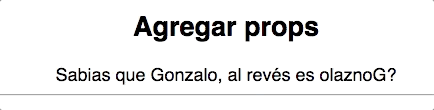

# Lección: Componiendo unos re componentes con Recompose

## Intro
> _Recompose is a React utility belt for function components and higher-order components. Think of it like lodash for React._

Listo, fín del curso. Ahre ☺️ xdxd.

Bueno, flogger out. Primero que nada, hola!
Me llamo **Gonzalo Pozzo** y en el momento de escribir esto era Frontend Developer en [The Next Ad](https://www.thenextad.com/) (De no ser así, hola desde el pasado!).
Hoy les vengo a hablar de una de las librerias que más uso y más me gusta, [Recompose](https://github.com/acdlite/recompose).
Como vimos un poco más arriba, recompose es una libreria de utilidades para componentes y **high-order components** de React.

### 🙋‍♂️️ Ni idea que es un high-order component.
No os preocupeis, es mucho más fácil de lo que parece.
Directo de [la documentación de React](https://reactjs.org/docs/higher-order-components.html):
> **A higher-order component is a function that takes a component and returns a new component.**
```javascript
const AltoComponente = unHighOrderComponent(UnComponenteMedioPelo);
```
Si usas [Redux](https://redux.js.org/docs/introduction/), su high-order component más conocido es *connect*. O si usas [Mobx](https://github.com/mobxjs/mobx) su high-order component más conocido es *observable*.
Si no te quedo claro, tranqui, esto recién empieza.

## Ejemplos
Basta de chacharas y vamos a ver algunos ejemplos de cosas que podemos hacer:

> Tip: [Acá](https://goncy.github.io/recompose-lesson) podes verlos a todos funcionando

### Agregar estado
#### [Código completo](./companion/src/components/AddState.js) - [Ejemplo editable](https://codesandbox.io/s/yp07yw1rmv)
Cuantas veces pasó que tuvimos que agregar solo una propiedad al state de nuestro componente y tuvimos que hacerlo componente para eso? `withState` al rescate.
> 

```javascript
const welcomeable = withState(
  // El primer parametro va a ser el nombre que queremos darle a nuestro state
  "welcomed",
  // El segundo parametro va a ser el nombre que queremos darle a la función que va a setear nuestro state
  "setWelcomed",
  // El tercer parametro es el valor inicial de nuestro state
  true
)

welcomeable(({welcomed}) => <div>{welcomed ? 'Welcome' : 'Fuck you'}</div>)
```

> TIP: Si te gusta el estilo reducer de Redux, podes usar [withReducer](https://github.com/acdlite/recompose/blob/master/docs/API.md#withreducer), si necesitas muchos estados podes simplemente nestear varios [withState](https://github.com/acdlite/recompose/blob/master/docs/API.md#withstate) o usar [withStateHandlers](https://github.com/acdlite/recompose/blob/master/docs/API.md#withstatehandlers)

### Rendering condicional
#### [Código completo](./companion/src/components/ConditionalRendering.js) - [Ejemplo editable](https://codesandbox.io/s/zn95pwkm4)
Renderizar o no un componente basado en una prop que le llega, aislar ese caso por ejemplo para login nos permitiria mostrar secciones solo para usuarios logeados sin repetir codigo, o mostrar un loader/spinner mientras una prop de loading este en true, ahi es donde `branch` de recompose entra en juego.
> 

```javascript
const justForLoggedUsers = branch(
  // El primer parametro es una function que recibe las props de nuestro componente y debe devolver true o false
  ({ logged }) => !logged,
  // En caso de que devuelva true (el usuario no esta logeado) va a renderizar este componente, notese que esta wrapeado en la funcion renderComponent
  renderComponent(Placeholder)
  // En caso de que de false va a renderizar nuestro componente original, como lo usamos mas abajo
)

justForLoggedUsers(() => <div>Solo me ves si estas loggeado</div>)
```

### Agregar lógica
#### [Código completo](./companion/src/components/AddLogic.js) - [Ejemplo editable](https://codesandbox.io/s/zl2336ro3x)
Muchas veces necesitamos agregar la misma lógica a varios de nuestros componentes, como por ejemplo, un state para guardar data de un formulario, con recompose y `withStateHandlers` podes crear tu propio high-order component y reutilizarlo en todos tus componentes
> 

```javascript
const withForm = withStateHandlers(
  // Armamos nuestro state inicial
  { formData: {} },
  {
    // Devolvemos nuestros handlers en un objeto donde cada key es un factory (una funcion que devuelve una funcion), la primer funcion recibe el state anterior, la segunda recibe los parametros que se le mandan en ejecucion
    setFormProp: ({ formData }) => (prop, value) => ({
      formData: { ...formData, [prop]: value }
    })
  }
)

withForm(({formData, setFormProp}) => <div>Esta es la info de mi formulario -> {JSON.stringify(formData)}</div>)
```

### Agregando props a base de nuestras props
#### [Código completo](./companion/src/components/AddProps.js) - [Ejemplo editable](https://codesandbox.io/s/y03rz2q4wz)
Posiblemente el título no se entiendo, por estoy acá, para explicarlo peor todavía. Muchas veces necesitamos props nuevas basadas en nuestras props viejas, para eso tenemos [withProps](https://github.com/acdlite/recompose/blob/master/docs/API.md#withprops) y [mapProps](https://github.com/acdlite/recompose/blob/master/docs/API.md#mapprops), ambas funcionan igual, solo que `withProps` agrega las props a nuestras props existentes y `mapProps` reemplaza todas nuestras props.
> 

```javascript
const flipName = withProps(({ name }) => ({
  flippedName: name
    .split("")
    .reverse()
    .join("")
}))

flipName(({name, flippedName}) => <div>Sabías que {name} al revés es {flippedName}?</div>)
```

### Componer varios high-order components
#### [Código completo](./companion/src/components/Compose.js) - [Ejemplo editable](https://codesandbox.io/s/vqz5q9zy60)
A veces necesitamos wrappear nuestr componente con varios high-order components, por ejemplo, `connect` de redux junto con `withState`, escribirlo como `withState(..., connect(MiComponenteMedioPelo))` se vuelve ilegible, más si tenemos que seguir agregando otros como `gql` de Apollo o más, para esto tenemos [compose](https://github.com/acdlite/recompose/blob/master/docs/API.md#compose). Compose nos permite componer *duh*, varios high-order components, dejando nuestro codigo mas legible.
> 

```javascript
// Componemos varios high-order components
const enhacer = compose(
  defaultProps({ name: "Gonzalo" }),
  withState("pristine", "setPristine", true)
)

enhacer(({pristine, setPristine, name}) => <div>Tengo todas mis props!</div>)
```

> TIP: Hay un patrón que se suele usar en Recompose que es crear una const `enhacer` con todos nuestros high-order components wrappeados en un `compose` y luego al exportar el componente se hace `export default enhacer(Component)`, permitiendo exportar por cada lado el `enhacer`, el `Component` y por defecto el componente wrappeado.

## Docs
* 📚 [Recompose API Docs](https://github.com/acdlite/recompose/blob/master/docs/API.md)
* ✏️ [Recompose Base fiddle](https://jsfiddle.net/samsch/p3vsmrvo/24/)

## Licencia
 📄 [Licencia MIT](https://github.com/ndelvalle/workshop-vuejs/blob/master/LICENSE)

---
*Cualquier consulta, critica, PR o sugerencia es totalmente bienvenida.*

**✍️ with ❤️ by [@goncy](http://github.com/goncy)**